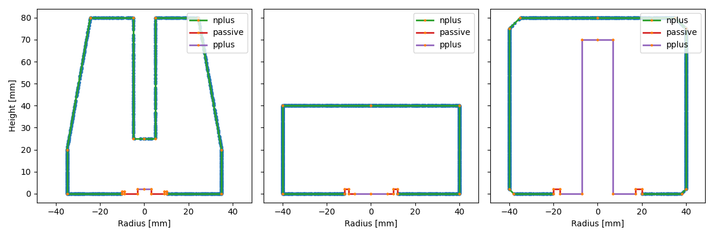

## pyvertexgen

[](https://github.com/pre-commit/pre-commit)
[](https://github.com/psf/black)


Tool for the generation of vertices (both positions and momenta) for
[remage](https://github.com/legend-exp/remage).

### Motivation

[remage](https://github.com/legend-exp/remage) is a framework for modern
simulations of Germanium and liquid Argon based experiments which separates the
geometry into easy to write python code with
[pg4ometry](https://pyg4ometry.readthedocs.io/en/stable/). Another challenging
aspect of the simulation is the generation of primary vertices (both positions
and kinematics). While `remage` has a number of native event generations
(`bxdecay0,musun` etc.) there are situations where we may want more control and
to not have to write new c++ generators. This package contains some event
generators which can write primary positions and kinematics that can be directly
read by `remage`.

### Example

One common situation is to generate events on the surface of Germanium
detectors. While this can be done in `Geant4` directly it is difficult to have
detailed control, for example generating on just one surface of the HPGe. The
information on the HPGe detectors is stored in python in the
[`legend-pygeom-hpges`](https://github.com/legend-exp/legend-pygeom-hpges/tree/main)
module. Using this we can generate events on the surface of one or several Ge
detectors

```python
from legendhpges import make_hpge, draw, utils
from pyvertexgen.generators import generate_many_hpge_surface
from pyg4ometry import geant4
import matplotlib.pyplot as plt
import numpy as np
from legendtestdata import LegendTestData

# get configs from LegendTestData
ldata = LegendTestData()
reg = geant4.Registry()
path = ldata.get_path("legend/metadata/hardware/detectors/germanium/diodes")

# get hpge objects
hpge_icpc = make_hpge(path + "/V99000A.json", registry=reg)
hpge_bege = make_hpge(path + "/B99000A.json", registry=reg)
hpge_coax = make_hpge(path + "/C99000A.json", registry=reg)
hpges = [hpge_icpc, hpge_bege, hpge_coax]

# now we can generate events on the nplus (or pplus or passive) surface of the HPGes (or all surfaces)
coords, ids = generate_many_hpge_surface(10000, hpges, surface_type="nplus")
```

Then we can plot the `(r,z)` components of the coords.

```python
fig, axs = plt.subplots(1, 3, figsize=(12, 4), sharey=True)
for idx in [0, 1, 2]:
    coords_rz = utils.convert_coords(coords[ids == idx])
    coords_rz[:, 0] *= np.where(coords[ids == idx, 0] > 0, 1, -1)
    draw.plot_profile(hpges[idx], split_by_type=True, axes=axs[idx])

    axs[idx].scatter(coords_rz[:, 0], coords_rz[:, 1], marker=".", label="gen. points")
    axs[idx].axis("equal")

    if idx == 0:
        axs[idx].set_ylabel("Height [mm]")
    axs[idx].set_xlabel("Radius [mm]")
    axs[idx].set_xlim(-50, 50)

fig.tight_layout()
```



We see the generated points on all the different geometries. You can also easily
generate on a different surface and save to a lh5 file. More details will be in
the documentation.
